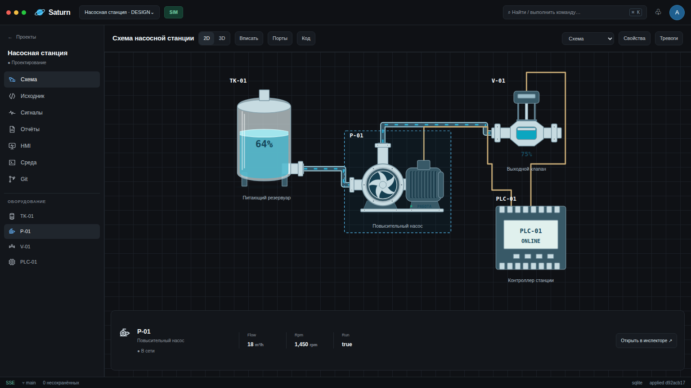
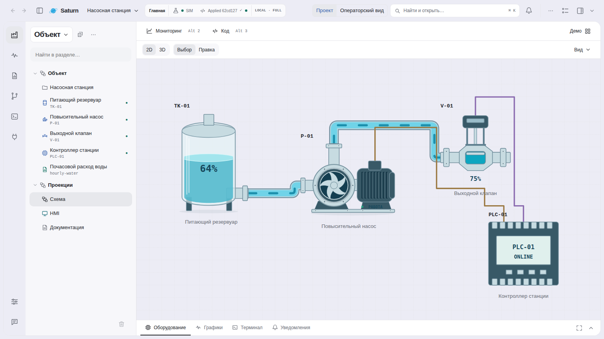
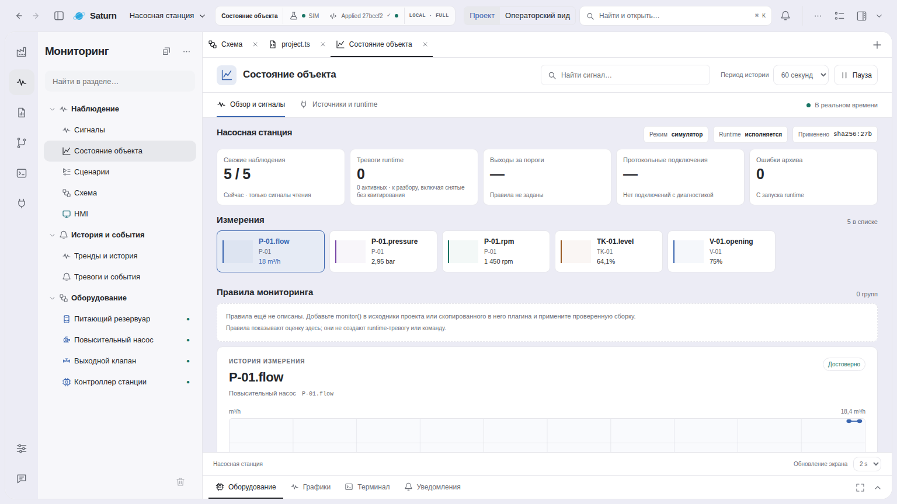
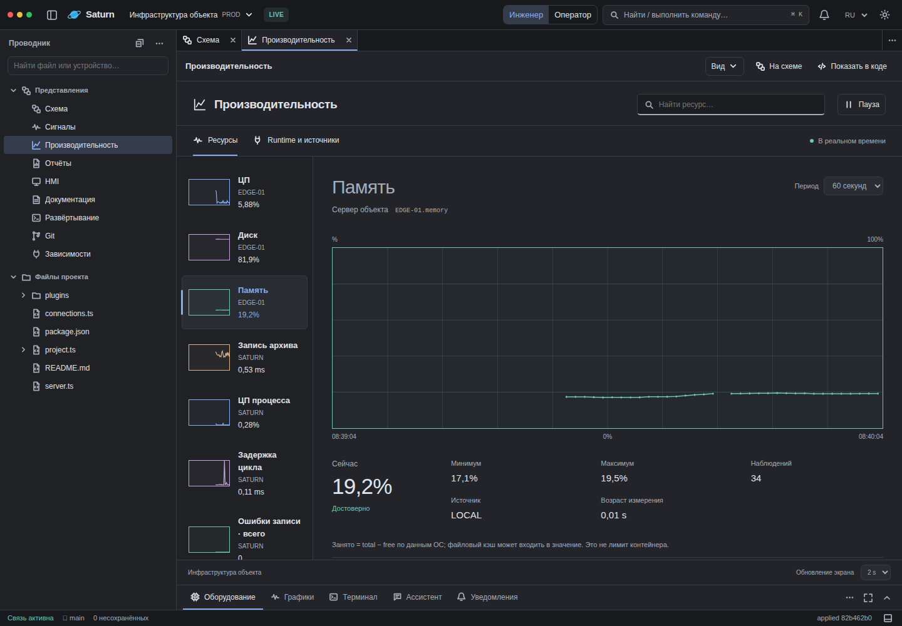
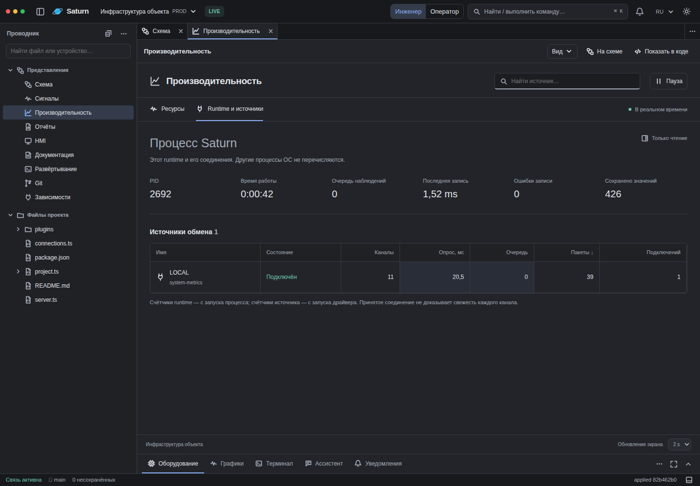
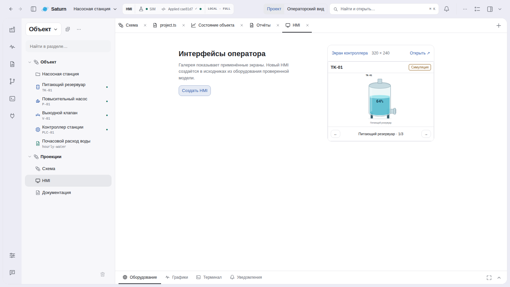
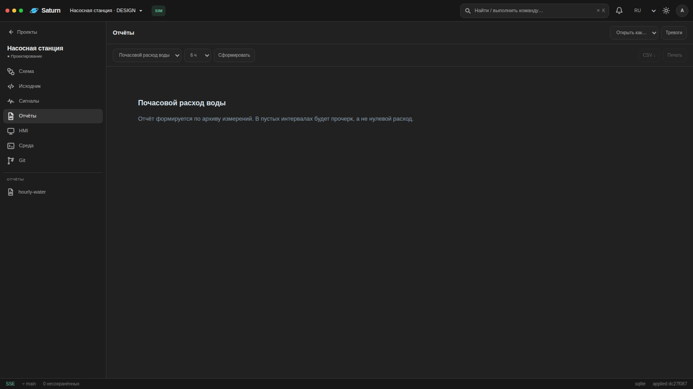
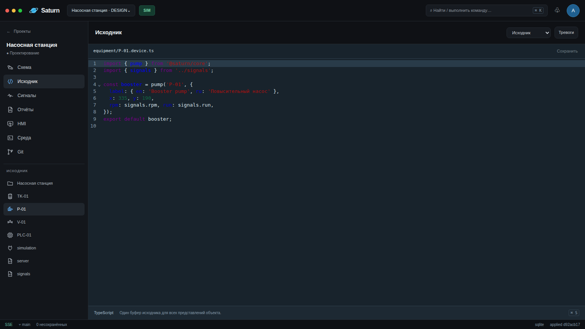

# Saturn IDE

**An engineering IDE where the system is the source code.**

Saturn models an industrial system as a TypeScript project and derives its engineering views,
runtime state and deployment artifacts from the same model.

```text
TypeScript project
       │
       ├── Diagram / 3D
       ├── HMI / Presentation
       ├── Signals / protocols
       ├── Runtime / alarms
       ├── History / reports
       ├── Performance / diagnostics
       └── Deployment
```

The goal is simple: avoid maintaining separate tag databases, HMI projects, runtime configuration
and engineering metadata when they describe the same system.



## System as code

A Saturn project is ordinary TypeScript.

```ts
import { bind, protocol, signal } from '@saturn/core';

export const temperature = bind(
  signal('reactor.temperature', {
    initial: 20,
    unit: '°C',
    staleAfter: 5000,
  }),
  protocol.modbus('controller-01', 120),
);
```

TypeScript provides modules, references, types, autocomplete, JSDoc and refactoring.
Saturn adds engineering semantics: equipment, topology, signals, quality, alarms, HMI,
history, reports and deployment.

Git remains the project history. A source diff is an engineering diff.

## One model, multiple projections

Saturn does not keep a second authored model for the diagram, HMI or runtime.

Equipment definitions own their ports, signals and capabilities. Instances remain ordinary
project objects. The Shell projects the same model into source, diagram, signals, HMI,
reports, deployment and runtime views.

Moving equipment on the diagram rewrites its authored coordinates in TypeScript. Connections
reroute before drop; the source is saved only after the gesture completes.



The resource explorer follows the same rule: an equipment instance is one engineering resource
with several views, not unrelated files and UI objects.

## Signals are the operational primitive

A signal has a stable engineering identity. Protocol addressing is metadata, so changing an
address or transport does not require renaming the domain signal.

The same `Signal`, `Sample` and quality rules are used by runtime, HMI, source hints,
reports, history and diagnostics.

Saturn distinguishes measurement time, receipt time and persisted event time. Missing data is
not replaced by `initial`, stale data is not reported as current, and bad/offline quality is
not downgraded by a disconnected browser.

Alarm transitions and acknowledgement use the same operational rules as every other projection.



See [ADR 0004](docs/adr/0004-operational-projections.md).

## Semantic inspection and impact

The project also has a derived semantic graph. Equipment, signals, connections, alarms, reports
and HMI consumers contribute relationships to that graph.

The same graph is used for inspection and change impact, so the IDE can answer questions such as:

```text
pressure signal
   ├── owned by PT-101
   ├── used by high-pressure alarm
   ├── displayed on operator HMI
   └── included in hourly report
```

This graph is disposable metadata derived from the TypeScript project; it is not another project
database.

## Runtime

Authoring and execution are intentionally separate.

```text
source
  ↓ check
checked BuildArtifact
  ↓ publish
published revision
  ↓ apply
applied revision
```

Saving a file does not silently change a running system.

The runtime owns observations, commands, alarms, history and the applied build. Applied revisions
are retained and restored independently from the current working tree.

A portable release can run in a compiler-free runtime host with no workspace, Git, TypeScript
compiler or Shell. Read, control and deploy use separate runtime credentials, and deploy/apply
operations are compare-and-swapped against the reviewed revision.

```sh
bun run release:build -- /path/to/project ./release
bun run release:deploy -- ./release/artifact.json https://runtime.example <published> <applied>
```

The development host is still a convenience composition; passing its tests is not a claim of
production fault tolerance or hardware safety.

## Performance and infrastructure

Infrastructure monitoring uses the same signal model instead of introducing a separate metrics
system.

The Performance surface can display numeric project signals with live previews and bounded
historian ranges. Runtime diagnostics expose acquisition-source state, process uptime, queue depth,
persistence counters and read latency without creating measurements or requiring SQL.





A project may add OS/process metrics through a normal acquisition extension. Those metrics then
behave like any other Saturn signal: they can be historized, inspected and visualized with the same
quality semantics.

See [Infrastructure and performance](docs/infrastructure.md).

## HMI and Presentation

HMI can be derived from physical topology or authored as Presentation elements when a screen is not
a direct physical projection.

Presentation elements reference canonical Saturn signals. They do not create a second tag model,
and imported screens do not have to masquerade as physical equipment.



## Reports and history

Reports consume the same signals and persisted observations as the runtime.

Coverage is explicit: missing or expired intervals are not filled with zero. Numeric history can
also be queried as bounded min/max/last envelopes for interactive charts without replacing the raw
history used for reports.



## Extensions

Equipment definitions, protocol adapters, displays, firmware targets and importers are normal
project-owned TypeScript source.

There is no global plugin registry or hidden activation lifecycle. A project explicitly imports
what it uses.

```ts
import importer from './plugins/existing-scada-importer';

export default {
  importers: [importer],
};
```

SCADA importers implement the public `ScadaImporter` contract and lower an external format into
ordinary Saturn source plus diagnostics.

```text
external project
      ↓
project-owned importer
      ↓
diagnostics + generated TypeScript
      ↓
normal Saturn check / Git / publish / apply
```

Format-specific parsing and compatibility rules stay in the source kit that owns them, not in
Saturn core.

See [SCADA importers](docs/importers.md).

## AI-native engineering

Because the engineering model is typed source code, external coding agents can reason about the same
representation as the engineer: equipment, topology, signals, protocol bindings, HMI, alarms,
reports and deployment.

Saturn does not implement its own agent harness. Agent runtime, authentication, model selection,
threads and native tools belong to external agents. IDE integration targets the open Agent Client
Protocol (ACP); Saturn-specific engineering context and safe operations are exposed through standard
integration boundaries such as MCP and the existing typed workspace/runtime APIs.

An agent proposal is still ordinary authored source: it must pass the same check, Git, publish and
apply lifecycle. Opening an agent session never grants runtime command or deployment authority.

Start any ACP-compatible agent in the current Saturn project:

```sh
bun agent -- npx -y @agentclientprotocol/codex-acp
```

The agent edits the same TypeScript files as the engineer. Saturn's existing watcher and build
pipeline refresh the derived projections; there is no agent-specific workspace or project model.
Permission requests are shown in the terminal and require an explicit choice.

## Shell

Saturn provides browser and terminal hosts over the same workspace contracts.

The browser Shell includes the project explorer, source editor, diagram, 3D, signals, HMI,
reports, Performance, deployment, Git and terminal surfaces.

The terminal host reuses project navigation, source buffers and server APIs where a graphical
projection is not required.



## Quick start

Requires Bun 1.4.2 or newer and Git. From this IDE checkout:

```sh
bun install
bun start init ../my-plant
bun start gui --project ../my-plant
```

The new project contains five files. The IDE opens it in the browser and creates a
**Checked** build without a project-local install. Add equipment from the diagram or import
project-owned TypeScript. A new empty project has no driver, measurements or Applied build.
Saving source does not apply it to equipment; automatic development preview is limited to a
declared simulator. Use `--manual` to disable that preview.

The installed executable uses the same commands: `saturn init ../my-plant` and
`saturn gui --project ../my-plant`. `saturn serve --project ../my-plant` starts the same
workspace host without opening a browser. See [First project](docs/quickstart.md) for the
checked/source/runtime steps and standalone TypeScript setup.

For the complete pumping-station example, clone `Pom4H/saturn-examples` next to this checkout,
install that project's dependencies (GitHub SSH access or an HTTPS credential helper is needed
for its pinned core dependency), and run
`bun start gui --project ../saturn-examples/pumping-station`. You can also copy that
example explicitly with `bun start init ../station-demo --template pumping-station` and install
dependencies in the copy.

SQLite works without configuration. PostgreSQL can be selected with `DATABASE_URL`.

For a terminal Shell connected to the same workspace server:

```sh
bun tui
```

The same command engine runs in the browser terminal, OpenTUI and `bun cli`.
Agents can use `bun cli --schema`, `--json`, `--complete` and `--batch`.
See [command shell](docs/command-shell.md).

## Development

```sh
bun run architecture:check
bun run check
bun test tests
bun run test:browser
```

The architecture guard keeps core, workspace, runtime, shell and host ownership explicit and
forbids product code from introducing a second authored project model.

`bun run ide:build` packages a native executable (GUI/CLI/TUI/worker). `bun run standalone:build`
packages the portable Windows host. Typed SQL reports export CSV, real XLSX and printable HTML
from the IDE or a Bun worker. See [delivery and jobs](docs/delivery-and-jobs.md),
[report migration](docs/report-migration.md) and [project structure](docs/project-structure.md).

More detail:

- [Architecture](docs/architecture.md)
- [Capability matrix](docs/capabilities.md)
- [Runtime deployment](docs/runtime-deployment.md)
- [Importer contract](docs/importers.md)
- [Infrastructure and performance](docs/infrastructure.md)
- [Command shell](docs/command-shell.md)
- [Delivery and jobs](docs/delivery-and-jobs.md)
- [Verification](docs/verification.md)

---

**The engineering project is the source of truth. Everything else is a projection, runtime state,
or build artifact.**
